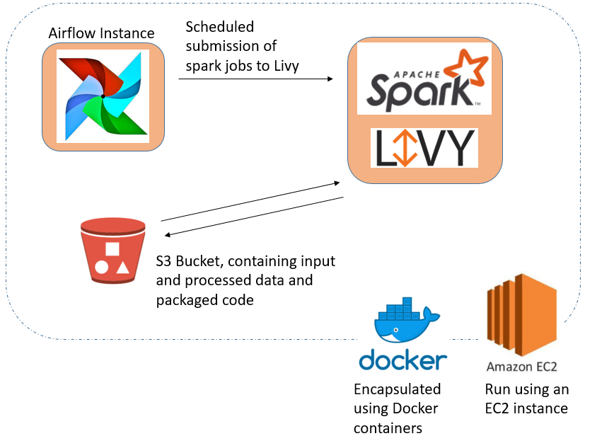

## Smart Lending Default Prediction


(Source of icon: https://www.flaticon.com/free-icon/car-loan_2505972)

## How to use this repo?
---
* This repo can act as an example on how to structure pyspark code to train a machine learning model.
* Data transformations are modularized into Transformers (app/transformers) then subsequently composed into a pipeline in our preprocess script (app/jobs/preprocess.py)
* After preprocessing, we fit our Estimators and compose a specialized pipeline that can be fitted on our training data and be used to transform/predict external data. (see app/jobs/train_model.py)
* See (Set-up) on how to set up environment and run scripts.


## Domain Background
---

* Financial institutions incur significant losses due to the default of vehicle loans every year.

  
## Problem Statement
---

* <ins>Goal:</ins> To accurately pre-empt problematic borrowers who are likely to default in future, our goal is to build a machine learning model that can accurately predict borrowers that are likely to default on first EMI (Equated Monthly Instalments)


## Data
---
* We used a public dataset that can be found on Kaggle: https://www.kaggle.com/avikpaul4u/vehicle-loan-default-prediction.

* Dataset has 50,000 rows with 41 columns

* As data is imbalanced, (about 80% of labels are non-default while 20% are defaults), our main metric of evaluating our trained model will be the AUC_ROC

## Technical Architecture
---



## Architecture of Model Training Pipeline
---


## Folder Structure
---
```bash
.
├── LICENSE
├── Makefile
├── README.md
├── airflow
│   ├── __init__.py
│   ├── config
│   │   └── airflow.cfg
│   ├── dags
│   │   ├── __init__.py
│   │   ├── model_inference_dag.py          # Airflow DAG for model inferencing
│   │   └── model_train_dag.py              # Airflow DAG for model training
│   ├── logs
│   └── plugins
│       ├── __init__.py
│       └── airflow_livy
│           ├── __init__.py
│           ├── batch.py                    # Custom Airflow Livy operator (for batch)
│           └── session.py                  # Custom Airflow Livy operator (for session)
├── app
│   ├── Makefile                            
│   ├── config.json
│   ├── dist
│   │   ├── config.json
│   │   ├── main.py
│   │   └── src.zip
│   ├── main.py
│   ├── src
│   │   ├── __init__.py
│   │   ├── conftest.py
│   │   ├── data
│   │   │   ├── inputs
│   │   │   │   └── loan_default.csv
│   │   ├── jobs
│   │   │   ├── __init__py
│   │   │   ├── inference.py                # Spark Job defined for inferencing
│   │   │   ├── preprocess_data.py          # Spark Job defined for data preprocessing
│   │   │   └── train_model.py              # Spark Job defined for training pyspark.ml GBT model
│   │   ├── models
│   │   │   ├── logs
│   │   │   └── models
│   │   ├── pipe
│   │   │   ├── IF.py
│   │   │   ├── __init__.py
│   │   │   └── pipe.py
│   │   ├── shared
│   │   │   ├── __init__.py
│   │   │   └── utils.py
│   │   └── transformers
│   │       ├── __init__.py
│   │       ├── convert_str_to_date.py
│   │       ├── drop_columns.py
│   │       ├── extract_time_period_mths.py
│   │       ├── get_age.py
│   │       ├── impute_cat_missing_vals.py
│   │       ├── remove_duplicates.py
│   │       └── replace_str_regex.py
│   └── tests
│       └── transformers
│           ├── test_convert_str_to_date.py
│           ├── test_drop_columns.py
│           ├── test_extract_time_period_mths.py
│           ├── test_get_age.py
│           ├── test_impute_cat_missing_vals.py
│           ├── test_remove_duplicates.py
│           └── test_replace_str_regex.py
├── data
├── docker
│   ├── airflow
│   │   ├── Dockerfile
│   │   ├── conf
│   │   │   ├── hadoop
│   │   │   │   ├── core-site.xml
│   │   │   │   ├── hadoop-env.sh
│   │   │   │   ├── hdfs-site.xml
│   │   │   │   ├── mapred-site.xml
│   │   │   │   ├── workers
│   │   │   │   └── yarn-site.xml
│   │   │   └── spark
│   │   │       └── spark-defaults.conf
│   │   └── entrypoint.sh
│   ├── hive
│   │   └── init.sql
│   ├── livy
│   │   └── Dockerfile
│   ├── master
│   │   ├── Dockerfile
│   │   └── master.sh
│   └── worker
│       ├── Dockerfile
│       └── worker.sh
├── docker-compose.yml
├── docs
│   └── images
│       ├── modelling_architecture.PNG
│       ├── project_icon.PNG
│       └── technical_architecture.PNG
├── notebooks
│   └── Loan Default Classification.ipynb			# Jupyter Notebook containing exploration
├── requirements.txt
── setup.py
```

## Results
---
* AUC_ROC: 0.625

## Set-up (Local)
---
Note that this project requires spark to be installed on a local system. 

* Run the following command for initial set-up of virtual environment:
    * Run ```make setup``` on home dir (outside app dir)

* Run the following commands to submit spark job (in app dir):  
    1. Run ```make build``` to move all dependencies for spark job to dist/ folder
    2. Run ```make preprocess_train``` to submit spark job to preprocess training data
    3. Run ```make train_model``` to submit spark job to train our model on preprocessed training data

* Running pytest:  
    * Run ```make test``` (in app dir)

## Set-up (AWS)
---
Note that this project requires spark to be installed on a local system. 

* Prerequisites:
    * An AWS Account, with a S3 bucket set up
    * EC2 instance (must have permission access to S3)
    * AWS cli installed locally


* Run the following commands:  
    1. Run ```make build``` to move all dependencies for spark job to dist/ folder
    2. Run ```make package_s3``` to move packaged dependencies to s3 bucket folder dist

* Run jobs on EC2 using Airflow and Livy:  
    * To set up Spark, Airflow and Livy, run ```docker-compose build``` at home dir (on EC2 ssh terminal).
    * After ```docker-compose build``` runs successfully, run ```docker-compose up```
    * Check on ec2 address: http://ec2-X-XXX-X-XXX.compute-1.amazonaws.com:9001/, airflow should be up and running, change port to 8998, livy should be up and running

* Variables configuration:

    * On airflow UI, set the following variables:
        1. aws_config:
            ```json
            {
                "awsKey": "Input your user's aws key",
                "awsSecretKey": "Input your user's aws secret key",
                "s3Bucket": "Input your s3 bucket for this project"
            }
            ```
        
        2. main_file_path:
            ```"main_file_path": "s3a://{YOUR_S3_BUCKET}/dist/main.py```

        3. pyfile_path:
            ```"pyfiles_path": "s3a://{YOUR_S3_BUCKET}/dist/src.zip``` 

        4. config_file_path:
            ```"config_file_path": "s3a://{YOUR_S3_BUCKET}/dist/config.json``` 

    * On airflow UI, also set up a HttpHook to livy:

        ```"conn_id": "livy", "host": "http://ec2-X-XXX-X-XXX.compute-1.amazonaws.com", "port": 8998```

    * Now airflow DAG should be able to run on UI 